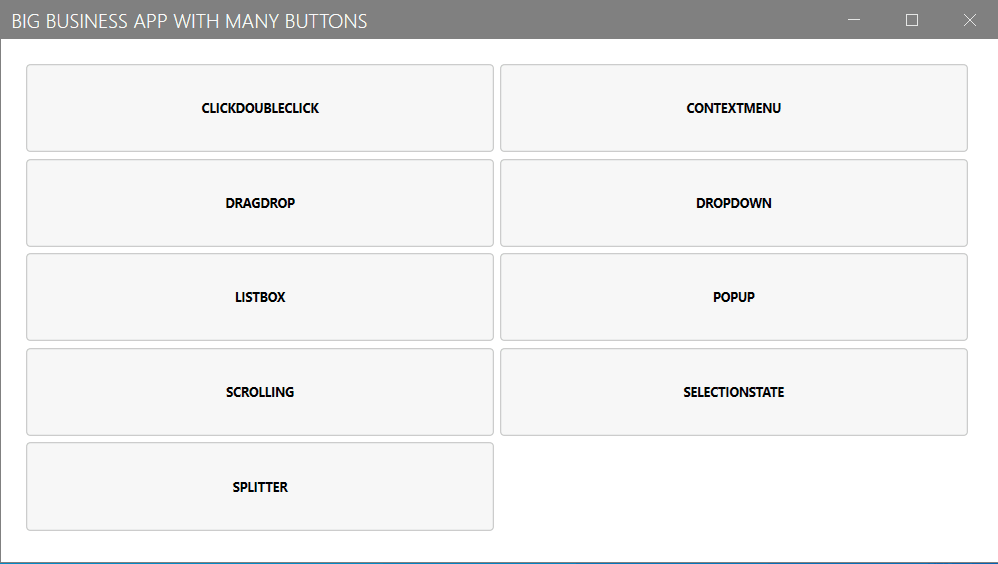

## Repository

This repository contains all the required content for the [Developer Open  Scpace](https://devopenspace.de/) workshop on deterministic builds in C#.

The premise of the workshop is the use, development and testing of a standard big corp. in-house WPF application.

    

Goal is to find out how to analyze changes in the code base and deciding which of the tests need to be executed instead of always running the whole test scope.

For this we will probe at
- deterministic builds
- mapping the build graph
- fingerprinting assemblies

## Tech stack & Tools

For the workshop we will be using 
- .NET 5.0
- WPF
- C#
- Powershell
- [/njuːk/](https://nuke.build/)
- [Visual Studio 2022](https://visualstudio.microsoft.com/)

## Let's get started

- [Project Setup](./src/Documentation/projectsetup.md) the solution
- [Building & Running](./src/Documentation/build_run.md) the solution
- [Challenges](./src/Documentation/Challenges/start.md) of a deterministic build

## Get in touch

## License

Copyright © Daniel Pisanu and contributors.

The workshop content is provided as-is under the MIT license. For more information see [LICENSE](./LICENSE).
