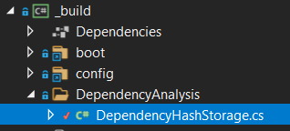

# Challenge 5 Solution

## Do we even remember changes?

Ideally you now have a new **Target** in your **Build.cs** which verifies each project assembly against a storage of known fingerprints.
In case a fingerprint is not known it is stored.

The following is one simple example how it could look like:

```csharp
Target HashAllAssemblies => _ => _
    .Executes(() =>
    {
        var dependencyHashStorage = new DependencyHashStorage(RootDirectory);
        var filesToHash = new List<string>();
           
        var dllFiles = Directory.EnumerateFiles(TestPath, "*.dll");
        var exeFiles = Directory.EnumerateFiles(TestPath, "*.exe");

        filesToHash.AddRange(dllFiles);
        filesToHash.AddRange(exeFiles);

        // loop over test binaries
        foreach (var fileToHash in filesToHash)
        {
            var hash = dependencyHashStorage.GenerateHash(fileToHash);
            dependencyHashStorage.StoreHash(hash);
            Console.WriteLine($"File {fileToHash} : Hash {hash}");
        }
        dependencyHashStorage.Dispose();
    });
```
Along with this new **Target** we also introduced a class that handles the complete Fingerprint mechanism for us. Based on a simple Hash calculation.

<p align="center">
    
</p>

Give this **Target** a spin with the following command:

```powershell
PS > .\build.ps1 HashAllAssemblies
```

---------------------------------------
[🔙 Return to challenge](../challenge5.md)

[🚦 Return to start](../start.md)