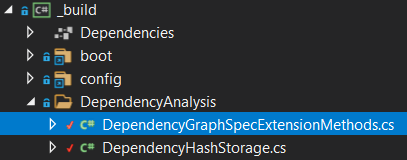

# Challenge 6 Solution

## Mapping my Dependency Graph!

The addition to the Build **Target** is not something that NUKE currently offers out of the box.
So for this we need to set the arguments manually and also define a global variable of there the graph should be stored to.

```csharp
DotNetBuild(s => s
    .SetProjectFile(Solution)
    .SetConfiguration(Configuration)
    .SetAssemblyVersion(GitVersion.AssemblySemVer)
    .SetFileVersion(GitVersion.AssemblySemFileVer)
    .SetInformationalVersion(GitVersion.InformationalVersion)
    .EnableNoRestore()
    .EnableDeterministic()
    .SetProcessArgumentConfigurator(x =>
        x.Add("/t:GenerateRestoreGraphFile")
            .Add($"/p:RestoreGraphOutputPath={DependencyGraphFilePath}")
    )
```

The mapping **Target** is in the first step a pure loop construct that can look like this:

```csharp
Target MapDependenciesOfTestAssemblies => _ => _
    .OnlyWhenDynamic(() => File.Exists(DependencyGraphFilePath))
    .Executes(() =>
    {
        // Load graph
        var dependencyGraph = DependencyGraphSpec.Load(DependencyGraphFilePath);

        // List all test assemblies
        var testFiles = Directory.EnumerateFiles(TestPath, "*Test.dll");
        // loop over test assemblies
        foreach (var testFile in testFiles)
        {
            Console.WriteLine($"Test assembly {testFile}");
            // Determine dependencies for test assembly
            var packageSpec = dependencyGraph.Projects.Single(p => p.GetBinPath() == testFile);
            var packageSpecDependencies = packageSpec.GetAllProjectReferences(dependencyGraph);
            // loop over all dependencies
            foreach(var dependencyCSProjectPath in packageSpecDependencies)
            {
                // get path to dependency
                var dependencyBinPath = dependencyGraph.Projects.Single(p => p.FilePath == dependencyCSProjectPath).GetBinPath();
                Console.WriteLine($"-> Test dependency {dependencyBinPath}");
            }
        }
    });
```
As mentioned in the _Hint_ we are providing an extension method to handle the **NuGet.ProjectModel.PackageSpec** operations.

<p align="center">
    
</p>

Give this **Target** a spin with the following command:

```powershell
PS > .\build.ps1 MapDependenciesOfTestAssemblies
```

---------------------------------------
[Return to challenge](../challenge6.md)

[🚦 Return to start](../start.md)