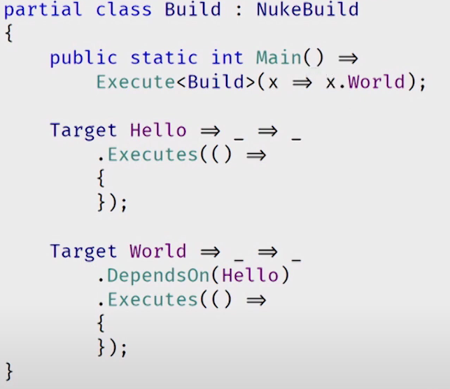
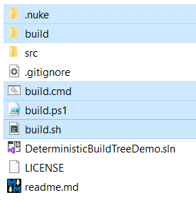
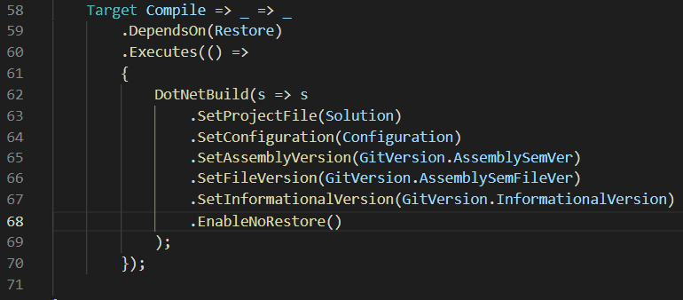

# Challenge 4

## Can we orchestrate consistency?

So we just saw that things are getting more complex. We are leaving the scope of an easy ```dotnet build``` call and some one liners in powershell. 
We require more robust build tools that allow us to handle the tasks at hand in code.

Come in [/njuːk/](https://nuke.build/).
- The cross-platform build automation solution for .NET with C# DSL.
- An approach to embrace existing IDE tooling.
- A state where everyone in a team is able to manage and change the build.

<p align="center">
    
</p>

#### Task: Install NUKE in order to continue all build related tasks in C#.

Let's [install](https://www.nuke.build/docs/getting-started/setup.html) NUKE as a global tool in order to orchestrate our build environment properly.

```powershell
dotnet tool install Nuke.GlobalTool --global
```

!! In case you get an exception from powershell, you need to change the execution policy as admin !!

```powershell
Set-ExecutionPolicy -ExecutionPolicy Unrestricted
```

Once installed head on over to the root directory of the project and let's setup NUKE from the command line / powershell.

```powershell
nuke :setup
```
<p align="center">
    
</p>

Once the setup is complete you will find two new folders and three script files in the root directory.
<p align="center">
    
</p>

the **build** scripts contain the bootstrap mechanism to NUKE and are the entry point to building with NUKE.
The _build_ Folder contains your build project where we can now extend the build logic.

Let's add the Deterministic flag to the compile option in the **Build.cs** class.
The NUKE DSL has it's own extension methods for certain a range of build objects.   
In this scenario we are working with _DotNetBuildSettings_ and here the method to use is following:
```csharp
.EnableDeterministic()
```
<p align="center">
    
</p>

Save your changes and now you can use the NUKE build script to compile your solution.
```powershell
PS > .\build.ps1

PowerShell Desktop version 5.1.19041.1320
Microsoft (R) .NET Core SDK version 5.0.403

███╗   ██╗██╗   ██╗██╗  ██╗███████╗
████╗  ██║██║   ██║██║ ██╔╝██╔════╝
██╔██╗ ██║██║   ██║█████╔╝ █████╗
██║╚██╗██║██║   ██║██╔═██╗ ██╔══╝
██║ ╚████║╚██████╔╝██║  ██╗███████╗
╚═╝  ╚═══╝ ╚═════╝ ╚═╝  ╚═╝╚══════╝

NUKE Execution Engine version 5.3.0 (Windows,.NETCoreApp,Version=v5.0)
...
...
...
═══════════════════════════════════════
Target             Status      Duration
───────────────────────────────────────
Restore            Succeeded       0:12
Compile            Succeeded       0:14
───────────────────────────────────────
Total                              0:26
═══════════════════════════════════════

Build succeeded on 24.11.2021 16:46:03. ＼（＾ᴗ＾）／
```

---------------------------------------
[⏭ Next challenge](./challenge5.md)

[🚦 Return to start](./start.md)