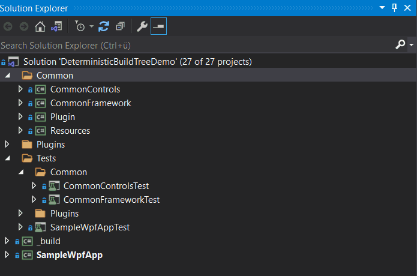

## Project

The project used for the workshop contains a WPF Application and several assemblies targeting either

```xml
<TargetFramework>net5.0-windows</TargetFramework>
```
or 
```xml
<TargetFramework>net5.0</TargetFramework>
```

The WPF application is using [MahApps Metro](https://github.com/MahApps/MahApps.Metro) and [MahApps Metro SimpleChildWindow](https://github.com/punker76/MahApps.Metro.SimpleChildWindow).  
The solution contains several [nunit](https://nunit.org/) projects test classes for the individual Application section.

<p align="center">
    
</p>

There is no dependency between the WPF Application and the Plugins which are loaded dynamically on startup of the main app.